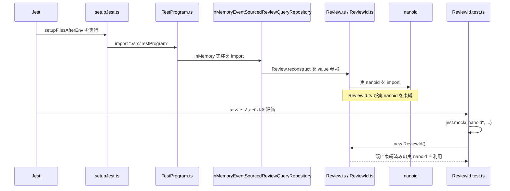
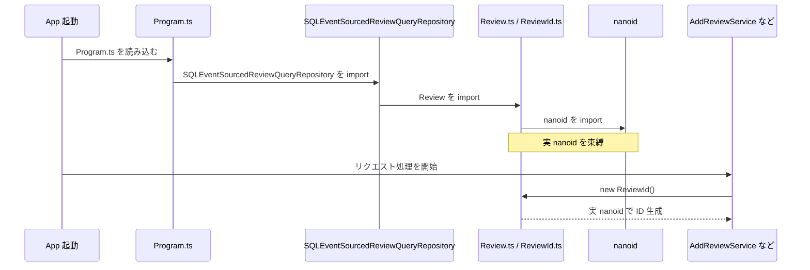

# Review 集約のイベントソーシング読取り対応計画

## 目的

書籍の範囲では、Review 集約の書き込みは Event テーブルへの append に寄せたが、読取りがまだ `IReviewRepository` (Review テーブル前提) に残っている。

この計画のゴールは次の 2 点である。

1. **読み取りをイベント再生に切り替える**: 推薦取得などの Review 読取り経路を、Event テーブルから Review 集約を再構築する形に置き換える。
2. **`IReviewRepository` から脱却する**: 読取りを切り替え終わったら、`IReviewRepository`、`SQLReviewRepository`、`InMemoryReviewRepository`、Review テーブルへの書込み経路をプロジェクトから削除する。最終的に Review 集約の唯一の永続化先は Event テーブルとなる。

将来的に CQRS Read model を追加する場合も、本計画で導入する読み取り専用インターフェースの実装差し替えで移行できる形にする。

## スコープ外

学習用プロジェクトとしてフォーカスを絞るため、以下は本計画では扱わない。必要になった時点で別計画として切り出す。

- スナップショット機構
- イベントスキーマの上位互換 / バージョニング戦略
- 外部 Bounded Context へのイベント配信 (Outbox の `publishedAt` / `findPendingEvents` 自体は既存実装をそのまま維持する)
- API の HTTP ステータス整理 (400/404/409 の分離)

## 採用方針

### 方針

`IReviewRepository` を Review 集約の永続化口として使い続けるのではなく、推薦取得などの読取り用途には読み取り専用の Query Repository を導入する。

最初の実装は Event テーブルから Review 関連イベントを取得し、Review 集約を再構築して返す。

```ts
interface IReviewQueryRepository {
  findAllByBookId(bookId: BookId): Promise<Review[]>;
}
```

読み取りを切り替え終わったら、`IReviewRepository` とその実装、Review テーブルへの書込みを順次削除する。

### このプロジェクトでの理由

- Review の読取り用途は現状 `GetRecommendedBooksService` が中心である。
- 推薦計算は `Review.isTrustworthy()` と `Review.extractRecommendedBooks()` に依存しており、ドメインモデルを再構築して使う方が自然である。
- CQRS Read model を先に作ると、projector、冪等性、projection 遅延、整合性方針まで必要になり、学習対象が広がりすぎる。
- Query Repository を挟めば、後から CQRS Read model 実装へ差し替えやすい。

## 完了条件

- `GetRecommendedBooksService` が Review テーブルではなく、イベントから再構築された Review を使う。
- レビュー投稿後、推薦取得 API が同じ Review を参照できる。
- 編集後のレビュー内容が推薦取得に反映される。
- 削除済みレビューは推薦取得から除外される。
- `IReviewRepository`, `SQLReviewRepository`, `InMemoryReviewRepository` がプロジェクトに存在しない (DI 登録もない)。
- アプリケーションサービスが `Review` テーブルへ書き込まない。Review 集約の永続化は Event テーブルのみ。
- SQL の読取りで `Review.create()` を使って未保存イベントを生成する経路がなくなる。
- イベント再生順が安定している。
- TypeScript の型チェックと Jest テストが通る。

## 対応ステップ

## Step 0: 現状の書き込み経路を確認する

### 目的

「`IReviewRepository` から脱却する」ためには、書き込み Service が `IReviewRepository` に依存していないことを先に確かめておく必要がある。読取り切り替え後に Step 4 で安全に削除するための前提作り。

### 確認事項

- `AddReviewService`, `EditReviewService`, `DeleteReviewService` の依存先が `IEventStoreRepository` のみで、`IReviewRepository` を使っていないこと。
- 上記 Service 内で `Review` テーブルへの直接書込みが残っていないこと。
- `SQLReviewRepository.save/update/delete` が実運用経路から呼ばれていないこと (テストのみ、もしくは未使用)。

### 実装方針

- `rg "IReviewRepository"` で参照箇所を洗い出す。
- 書き込み Service に依存が残っている場合は、本ステップで `IEventStoreRepository.store()` のみに置き換える。
- 二重書込みになっている経路があれば、Event テーブル側だけに寄せる。

### テストリスト

- [x] `AddReviewService` のテストで `IReviewRepository` のモックが使われていない。
- [x] `EditReviewService` のテストで `IReviewRepository` のモックが使われていない。
- [x] `DeleteReviewService` のテストで `IReviewRepository` のモックが使われていない。
- [x] 書き込み Service 経由でレビュー操作した後、`Review` テーブル行が増えない (Event テーブル行のみ増える)。

### 実装のヒント

- 既に書き込みは Event ストア中心に寄っているが、明示的にスナップショットを取り、後続 Step の安全な前提とする。
- ここで残っている依存があれば、Step 4 の削除作業が複雑になるので必ず潰しておく。

## Step 1: 読み取り専用インターフェースを追加する

### 目的

アプリケーションサービスが `IReviewRepository` に依存している状態を解消し、書き込み系 Repository と読み取り系 Query Repository を分ける。

### 実装方針

- `Domain/models/Review/IReviewQueryRepository.ts` を追加する。
- メソッドはまず `findAllByBookId(bookId: BookId): Promise<Review[]>` のみにする。
- `GetRecommendedBooksService` の依存を `IReviewRepository` から `IReviewQueryRepository` に変更する。
- DI 登録に `"IReviewQueryRepository"` を追加する。

### テストリスト

- [x] `GetRecommendedBooksService` が `IReviewQueryRepository` から取得したレビューを使って推薦書籍を返す。
- [x] `GetRecommendedBooksService` が `IReviewRepository` ではなく `IReviewQueryRepository` に依存していることが分かる。
- [x] `IReviewQueryRepository` が空配列を返した場合、推薦書籍は空配列になる。

### 実装のヒント

- 既存の `GetRecommendedBooksService.test.ts` を `InMemoryReviewQueryRepository` または簡易 fake で通す。
- テスト内で private property を覗く形はできればやめ、DI コンテナまたは明示的な fake で依存を差し替える。
- `IReviewRepository` の読み取り用途が残っていないか `rg "IReviewRepository|findAllByBookId"` で確認する。

## Step 2: イベントストアに Review 読取り用クエリを追加する

### 目的

指定された bookId に紐づく Review 集約を、Event テーブルから探して再構築できるようにする。

### 実装方針

学習用として、最初は次の単純な流れでよい。

1. `ReviewCreated` かつ `eventBody.bookId = 指定 bookId` のイベントを取得する。
2. 取得した `aggregateId` ごとに Review の全イベントを読み込む。
3. `Review.reconstruct(events)` で集約を再構築する。
4. `ReviewDeleted` 済みで `null` になったものは除外する。

SQL 実装では JSONB 条件を使う。

```sql
WHERE "aggregateType" = 'Review'
  AND "eventType" = 'ReviewCreated'
  AND "eventBody"->>'bookId' = $1
```

### テストリスト

- [x] `ReviewCreated` イベントだけがある場合、指定 bookId の Review が返る。
- [x] 別 bookId の Review は返らない。
- [x] 複数 Review が同じ bookId にある場合、すべて返る。
- [x] `ReviewNameUpdated` が反映された最新の名前で返る。
- [x] `ReviewRatingUpdated` が反映された最新の評価で返る。
- [x] `ReviewCommentEdited` が反映された最新のコメントで返る。
- [x] `ReviewDeleted` まで含む Review は返らない。

### 実装のヒント

- `InMemoryEventStoreRepository` または新しい `InMemoryReviewQueryRepository` で上記を最小実装する。
- SQL のクエリ実装は、単体テストしやすい範囲で `SQLEventSourcedReviewQueryRepository` として分離する。
- イベント再生順は現状 `occurredOn` のみに依存している。テストが falky になりうる場合は Step 5 (version) を先に着手する。
- `eventType` 文字列の重複が気になる場合だけ、Review イベント型や factory 側から参照しやすい定数化を検討する。
- ただし学習用なので、過剰な抽象化は避ける。

### 残課題: `ReviewId.test.ts` の `nanoid` モックが効かない

#### 現象

Step 2 の InMemory 実装 (`InMemoryEventSourcedReviewQueryRepository`) を入れたあと、`src/Domain/models/Review/ReviewId/ReviewId.test.ts` の「デフォルトの値で ReviewId を生成する」テストが失敗するようになる。`new ReviewId()` が `jest.mock("nanoid", ...)` で差し替えたモック値 `"testIdWithExactLength"` を返さない。

#### 原因

1. `setupJest.ts` が `TestProgram.ts` を import する。
2. `TestProgram.ts` → `InMemoryEventSourcedReviewQueryRepository` → `Review.reconstruct(...)` の **value 参照** により、`Review.ts` が eager に評価される。
3. その先の `ReviewId.ts` → `nanoid` も eager に読み込まれ、モジュール束縛が確定する。
4. テストファイルの `jest.mock("nanoid", ...)` は (hoist されるが) 上記 setupJest 経由の eager 読み込みより後に評価されるため、既に `ReviewId` モジュールがキャプチャした実 `nanoid` を上書きできない。
5. 結果として `new ReviewId()` が実 `nanoid` を呼び、モック値にならない。

Step 1 までは InMemory 実装が TODO スタブだったため `Review` は型としてしか参照されず、import が elision されてこの問題は顕在化していなかった。Step 2 の InMemory 実装で Review が value 参照になった時点で踏むようになった。

#### 図で見る読み込み順

テスト時は、`ReviewId.test.ts` 自身が `nanoid` をモックしたいのに、その前段で `setupJest.ts` が `TestProgram.ts` を経由して `ReviewId.ts` まで先に読んでしまう。



この流れでは、問題は `jest.mock` の hoist が弱いことではなく、**`ReviewId.ts` がテストファイルより先に評価済みになること**にある。`ReviewId.ts` が一度実 `nanoid` を捕まえると、その後で `ReviewId.test.ts` 側からモックを差し込んでも間に合わない。

比較対象として、プロダクションでは `Program.ts` も起動時に Query Repository 実装を import するため、やはり `Review.ts` / `ReviewId.ts` / `nanoid` まで早い段階で読まれうる。



ただし、プロダクションではこれは不具合ではない。**本番では最初から実 `nanoid` を使いたい**ため、起動時に早めに束縛されても問題がない。一方テストでは、後から `jest.mock("nanoid")` で差し替えたいので、`setupJest.ts` による先読みと衝突する。

要するに、両者とも「早い段階で `ReviewId.ts` と `nanoid` が読まれる」点は似ているが、違いは次の 1 点に尽きる。

- production: 実 `nanoid` をそのまま使うので eager import でも困らない。
- test: 後からモックへ差し替えたいので eager import が問題化する。

#### 対処の選択肢

- `ReviewId.test.ts` 側で `jest.isolateModules` / `jest.resetModules` を使って ReviewId を再ロードする。
- `__mocks__/nanoid.ts` を置いてグローバルモック化する。
- `setupJest.ts` から `TestProgram` の import を外し、各テストで明示的に DI 登録する (一番影響範囲が広い)。
- `ReviewId.ts` 側を `nanoid` 遅延参照に変える (production コードを test 都合で変えるのは avoid したい)。

学習用としては最初の `jest.isolateModules` 案が最小コスト。

#### テストリスト

- [x] `ReviewId.test.ts` のすべてのテストが、Step 2 の InMemory 実装が入った状態でも通る。
- [x] `npx jest --runInBand` (SQL を除く) が全件パスする。

#### 着手判断

- Step 2 のメイン作業 (SQL/InMemory 実装とそれぞれの単体テスト) はクローズしてよい。
- `ReviewId.test.ts` の失敗は Step 2 着地後の残課題として扱い、Step 3 に進む前 or Step 3 と並行で対応する。
- Step 4 で `IReviewRepository` 周辺を削除する際にも `setupJest` / `TestProgram` の import 経路は影響範囲なので、その前には片付けておきたい。

## Step 3: GetRecommendedBooksService をイベント再生ベースに接続する

### 目的

レビュー投稿、編集、削除の結果が推薦取得に反映されるようにする。

### 実装方針

- `GetRecommendedBooksService` は `IReviewQueryRepository.findAllByBookId()` から Review を取得する。
- 本番 DI では `"IReviewQueryRepository"` に `SQLEventSourcedReviewQueryRepository` を登録する。
- テスト DI では `"IReviewQueryRepository"` にイベント再生できるインメモリ実装を登録する。

### テストリスト

- [x] `AddReviewService` でレビュー投稿した後、`GetRecommendedBooksService` で推薦書籍が返る。
- [x] `EditReviewService` でコメントを変更した後、推薦結果が変更後コメントに基づく。
- [x] `EditReviewService` で評価を変更した後、信頼度判定が変更後評価に基づく。
- [x] `DeleteReviewService` で削除したレビューは推薦結果から消える。
- [x] 対象 bookId にレビューが存在しない場合、推薦書籍は空配列になる。

### 実装のヒント

- アプリケーションサービスの結合テストをインメモリイベントストアで通す。
- `TestProgram.ts` の DI 登録を、書き込み用 (`IEventStoreRepository`) と読み取り用 (`IReviewQueryRepository`) で明確に分ける。
- ここでは `IReviewRepository` の登録はまだ残してよい (Step 4 で削除する)。

## Step 4: IReviewRepository を削除する

### 目的

`GetRecommendedBooksService` が `IReviewQueryRepository` 経由で動くようになった時点で、`IReviewRepository` とその実装を完全に削除し、Review 集約の永続化先を Event テーブルだけにする。これが本計画のメインゴール。

### 実装方針

1. `Program.ts`, `TestProgram.ts` から `"IReviewRepository"` の DI 登録を外す。
2. `SQLReviewRepository.ts` を削除する。`Review.create()` を読取り経路で呼ぶ問題ごと消える。
3. `InMemoryReviewRepository.ts` を削除する。
4. `IReviewRepository.ts` を削除する。
5. `Review` テーブルへの書込み / DDL を削除する。Review テーブル自体を drop するための migration を追加する (学習用プロジェクトなので drop で構わない)。
6. `rg "IReviewRepository|SQLReviewRepository|InMemoryReviewRepository"` で参照ゼロを確認する。

### テストリスト

- [x] `IReviewRepository` のシンボルがプロジェクトに存在しない。
- [x] `SQLReviewRepository` / `InMemoryReviewRepository` のファイルが存在しない。
- [x] DI コンテナに `"IReviewRepository"` が登録されていない。
- [x] `Review.create()` の呼び出し元はアプリケーションサービス (`AddReviewService` など) のみ。
- [x] `Review` テーブルを参照する実コードがない。
- [x] 既存テストとアプリケーション動作 (Step 3 までの結合テスト) が引き続き通る。

### 実装のヒント

- 削除前に `git grep` で参照を網羅し、コメントや旧テストファイルにも残っていないか確認する。
- 既存環境で `Review` テーブルにデータがある場合、drop 用の migration ファイルを追加する。学習用プロジェクトなので「drop して再構築」で良い。
- README にイベントソーシング前の名残として `Review` テーブルが存在した経緯を残すかは任意。残す場合は「過去のスキーマ」として明示する。

## Step 5: イベント順序を安定させる (任意・読取り精度向上)

### 目的

イベント再生順が `occurredOn` だけに依存している状態を解消する。`IReviewRepository` 脱却の必須要件ではないが、Step 2 のテストが時刻同値で不安定になる場合や、本番運用に近づける場合に着手する。

### 着手判断

- Step 2 のテストで同時刻イベントの順序が原因で flaky になったら即着手する。
- そうでなければ Step 4 の後で構わない。

### 実装方針

- Event テーブルに stream version を追加する。
- 同一 aggregate stream 内で version が単調増加するようにする。
- 再生時は `ORDER BY "version" ASC` にする。

例:

```sql
ALTER TABLE "Event" ADD COLUMN "version" INTEGER;
CREATE UNIQUE INDEX "Event_aggregate_version_idx"
  ON "Event"("aggregateId", "aggregateType", "version");
```

既存データの埋め戻しは、学習用プロジェクトなので **Event テーブルを drop して作り直す** か、`aggregateId + aggregateType` ごとに `occurredOn` 順で version を埋める migration を選ぶ。  
~~本計画では drop & 再構築を推奨する。~~ -> ALTER TABLE で version を追加し、既存データを occurredOn 順で更新する。

### テストリスト

- [x] 同一 aggregate に複数イベントを保存すると version が 1, 2, 3 と増える。
- [x] 再構築は `occurredOn` ではなく version 順で行われる。
- [x] 同一 version の重複 append はエラーになる。
- [x] `ReviewNameUpdated` と `ReviewDeleted` が同時刻でも、version 順により削除済みとして扱われる。

### 実装のヒント

- InMemory 実装でも version を持つ形に合わせる。
- SQL 実装では unique index で重複を防ぐ。
- `DomainEvent` に version を持たせるか、永続化レイヤだけの概念にするかを決める。
- 学習用には `DomainEvent` に `version` を持たせた方が流れを追いやすい。

## Step 6: append 時の競合制御を追加する (任意・書き込み堅牢化)

### 目的

同じ Review を同時編集した場合に、想定しないイベント列が混ざることを防ぐ。`IReviewRepository` 脱却の必須要件ではないが、書き込みの堅牢化として価値がある。Step 5 (version) の後に着手する。

### 実装方針

- 集約が「読み込まれた時点の version」を保持する。
- `eventStoreRepository.store(aggregate)` ではなく、期待 version を使う append にする。
- SQL では transaction 内で現在の最大 version を確認し、期待値と一致する場合のみ INSERT する。

候補:

```ts
store(aggregate: Aggregate<DomainEvent>, expectedVersion: number): Promise<void>;
```

または Aggregate に version を持たせる。

```ts
aggregate.version
aggregate.getDomainEvents()
```

### テストリスト

- [ ] version 1 の Review を2回読み込み、片方を保存した後、もう片方の保存は競合エラーになる。
- [ ] 新規 Review は expectedVersion 0 で保存できる。
- [ ] 既存 Review の更新は現在 version と expectedVersion が一致する場合だけ保存できる。
- [ ] 削除済み Review に対する追加更新はできない。
- [ ] SQL transaction 内でも競合時に一方だけが成功する。

### 実装のヒント

- InMemoryEventStoreRepository で競合検知を実装してから SQL 実装へ進む。
- エラー型を `ConcurrencyError` のように明示するか検討する。
- アプリケーションサービス側で競合エラーをどう扱うかは、この段階では再 throw でよい。

## Step 7: API レベルの動作確認を追加する

### 目的

実際のユースケースとして、投稿、推薦取得、編集、削除がイベントソーシング読取りでつながっていることを確認する。

### テストリスト

- [ ] 書籍登録後、レビュー投稿し、推薦取得で投稿内容由来の推薦が返る。
- [ ] レビュー編集後、推薦取得が編集後コメントを反映する。
- [ ] レビュー削除後、推薦取得から該当レビューの推薦が消える。
- [ ] SQL 実装でレビュー投稿後に推薦取得へ反映される。
- [ ] SQL 実装でレビュー編集後に推薦取得へ反映される。
- [ ] SQL 実装でレビュー削除後に推薦取得から除外される。

### 実装のヒント

- まずはアプリケーションサービス結合テストで通す。
- 余力があれば Express endpoint のテストを追加する。
- API の catch がすべて 500 を返しているため、必要なら後続タスクで 400/404/409 を分ける (本計画のスコープ外)。

## 実装順序の推奨

1. (Step 0) 現状の書き込み経路を確認し、`IReviewRepository` への依存が残っていないか洗い出す。
2. (Step 1) `IReviewQueryRepository` を追加する。
3. (Step 1) `GetRecommendedBooksService` の依存を `IReviewQueryRepository` に変える。
4. (Step 2) インメモリのイベント再生 Query Repository を作る。
5. (Step 3) 投稿後に推薦取得できる結合テストを追加する。
6. (Step 2) SQL のイベント再生 Query Repository を作る。
7. (Step 4) `Program.ts` / `TestProgram.ts` から `IReviewRepository` 登録を外す。
8. (Step 4) `SQLReviewRepository`, `InMemoryReviewRepository`, `IReviewRepository`, `Review` テーブルを削除する。
9. (Step 5 任意) Event に version を追加する。Step 2 のテストが flaky なら 4. の前に前倒し。
10. (Step 6 任意) append 時の expectedVersion 競合制御を追加する。
11. (Step 7) 削除、編集、同時更新のテストを足す。
12. README に Review 集約のイベントソーシング構成を追記する。

## 手作業実装時のチェックリスト

- `GetRecommendedBooksService` は `IReviewRepository` に依存していない。
- `Program.ts` に `"IReviewQueryRepository"` の登録がある。
- `TestProgram.ts` に `"IReviewQueryRepository"` の登録がある。
- `Program.ts` / `TestProgram.ts` に `"IReviewRepository"` の登録が **ない**。
- `IReviewRepository.ts` / `SQLReviewRepository.ts` / `InMemoryReviewRepository.ts` がプロジェクトに **ない**。
- `Review` テーブルを読み書きする実コードが **ない**。
- 推薦取得が Event テーブルからの再構築だけで動く。
- `Review.create()` は新規作成時の `AddReviewService` などからだけ使われている。
- `Review.reconstruct()` 後の `getDomainEvents()` は空である。
- `ReviewDeleted` 後の replay は `null` を返し、query result から除外される。
- (Step 5 着手時のみ) Event replay は version 順である。
- (Step 6 着手時のみ) append 競合時に検知できる。

## 実行コマンド

```bash
cd CatalogService
npx tsc --noEmit
npx jest --runInBand
```

SQL integration test を確認する場合:

```bash
cd CatalogService
docker compose up -d
npx jest --runInBand src/Infrastructure/SQL
```

## 後続で CQRS Read model に移行する条件

以下のいずれかが出てきたら、CQRS Read model を追加する価値がある。

- Review 数が増え、毎回イベント再生する推薦取得が遅くなった。
- Review 一覧、検索、集計など、集約再構築より SQL の方が自然な読取りが増えた。
- projection 遅延や eventually consistent な読取りを教材として扱いたくなった。
- 複数 bounded context へイベントを配信し、購読側の read model を育てる構成に進みたくなった。

その場合も `IReviewQueryRepository` は維持し、実装だけを `EventSourcedReviewQueryRepository` から `SQLReviewReadModelRepository` に差し替える。Read model 用の Review テーブル / DTO はその時点で新規に設計する (本計画で削除するものとは別物)。
